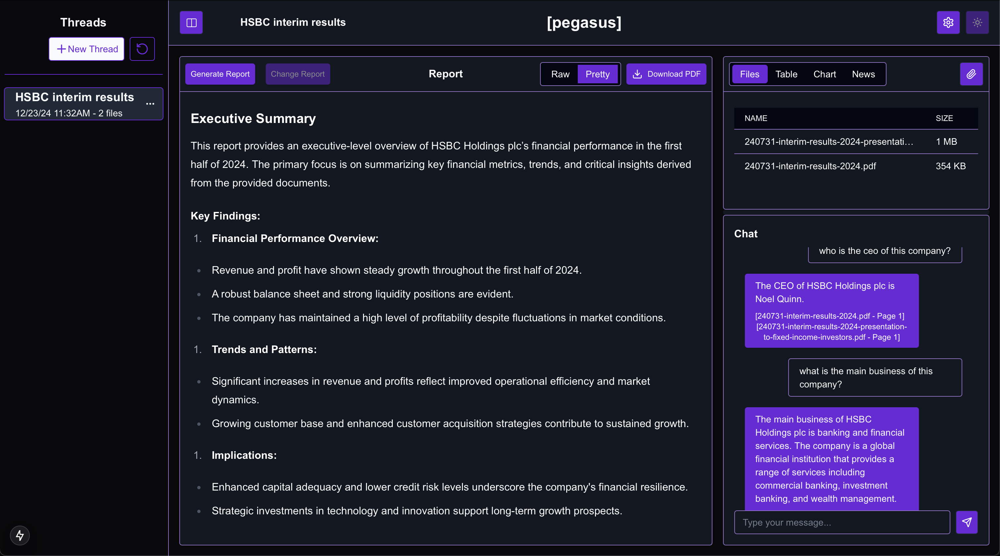

# Pegasus

Pegasus is an AI-driven financial analysis platform designed to streamline document ingestion and reporting. It leverages large language models (LLMs) for both text and multimodal (vision) tasks, enabling complex PDF ingestion, chunk-wise summaries, and robust interactive chat features.

---

## Table of Contents

- [Background](#background)
- [Features](#features)
- [Tech Stack](#tech-stack)
- [Installation](#installation)
  - [Prerequisites](#prerequisites)
  - [Server Setup (Python)](#server-setup-python)
  - [UI Setup (Nextjs)](#ui-setup-nextjs)
  - [Running the Application](#running-the-application)
- [Usage](#usage)
- [Contribution Guide](#contribution-guide)
- [Future Improvements](#future-improvements)
- [License](#license)

---


## Background

Financial analysts frequently work with large, unstructured documents (PDFs, Word documents, etc.) and spend significant time extracting key metrics and commentary to produce financial reports. **Pegasus** automates and augments this process by:

1. Indexing documents (supporting PDF, DOC, DOCX) for quick retrieval. This uses the ColPali pipeline for all kinds of documents.    
2. Generating chunk-based summaries for multi-page files using a vision-language model (Qwen2-VL).  
3. Creating a final, multi-section financial analysis report with minimal user input.  
4. Offering a user-friendly chat interface to query the ingested documents and retrieve relevant context.

---

## Features

- **Document Ingestion & Indexing**  
  Upload PDF/DOC/DOCX documents, automatically convert them to text or PDF, and index them using [Byaldi’s RAGMultiModalModel](https://pypi.org/project/byaldi/) for retrieval.

- **RAG (Retrieval-Augmented Generation)**  
  Quickly fetch relevant pages/sections from ingested PDFs.

- **Vision + Text Models**  
  Summaries are generated by a large vision-language model, while text-only LLMs (Qwen2.5 series) create the final cohesive report.

- **Interactive Chat**  
  Query the AI about financial or general questions; the system automatically retrieves supporting context from the indexed documents.

- **Report Generation**  
  Generate a structured financial analysis report (executive summary, key metrics, detailed analysis, trends, and conclusions).

---

## Tech Stack

### Server

- **Language & Framework**: Python 3.11 + [FastAPI](https://fastapi.tiangolo.com/)  
- **Core Libraries**:  
  - [Byaldi](https://pypi.org/project/byaldi/) for RAG indexing  
  - [Transformers](https://github.com/huggingface/transformers) for model loading  
  - [docx2pdf](https://github.com/AlJohri/docx2pdf) for document conversion  
  - [PyMuPDF (fitz)](https://github.com/pymupdf/PyMuPDF) for PDF processing  

### UI

- **Language & Framework**: TypeScript, [Next.js 15](https://nextjs.org/) (App Router)  
- **Styling**: [Tailwind CSS](https://tailwindcss.com/)  
- **UI Components**: [Radix UI](https://www.radix-ui.com/), [ShadCN/UI libraries](https://ui.shadcn.com/)  
- **State Management**: React hooks & local state  
- **Other Libraries**:
  - React Dropzone for file uploads  
  - React Markdown / Showdown for Markdown rendering  
  - Plotly.js / Chart.js for prospective data visualization  


## Installation

### Prerequisites

1. **Python 3.11 and uv** (the code specifically targets 3.11)  
2. **Node.js & npm** (latest LTS recommended, e.g., Node 18+)  
3. **Git**  

---

### Server Setup (Python)

1. **Clone the Repository**:
```bash
git clone https://github.com/Arrabonae/pegasus.git
cd pegasus
```

2. **Create & Activate a Virtual Environment (optional but recommended):**
``` bash
uv venv
source venv/bin/activate  # On Mac/Linux
```

3. **Install Python Dependencies:**
```bash
uv pip install -r requirements.txt
```

4. **Run the Server:**
```bash
uvicorn server.main:app --host 0.0.0.0 --port 5050 --reload
```
The server will be available at http://localhost:5050.

### UI Setup (Next.js)
1. **Install Node Dependencies:**
```bash
npm install
```

2. **Run the Development Server:**
```bash
npm run dev
```
The UI will be running on http://localhost:3000.

### Running the Application
1. Start the Python (FastAPI) Server on port 5050.
2. Start the Next.js Dev Server on port 3000.
3. In your browser, navigate to http://localhost:3000.
The UI communicates with the backend at http://localhost:5050.

## Usage
1. Create a New Thread
	* Click “New Thread” in the sidebar.
	* Upload a PDF/DOC/DOCX file, provide a descriptive title, and start indexing.
2. Add Additional Files
	* In the right-hand “Files” tab, use the paperclip icon to upload more files to the current session.
3. Chat with the AI
	* Use the chat box at the bottom-right corner to ask questions.
	* The AI retrieves relevant pages from your indexed documents, providing answers with references.
4. Generate a Report
	* In the main “Report” panel, click “Generate Report.”
	* A multi-section report (executive summary, key metrics, detailed analysis, trends, and conclusions) is compiled by the vision + text LLM pipeline.

## Contribution Guide

We welcome your contributions and feedback! Here’s how you can get involved:
1. Fork the repository and clone to your local machine.
2. Create a new branch for your feature or bug fix:
```bash
git checkout -b feature/your-feature
```
3. Commit your changes with clear messages:
```bash
git commit -m "Add awesome feature"
```
4. Push to your fork and create a Pull Request from GitHub.

We encourage discussions around project architecture, code style, or new features. Feel free to open an issue or start a GitHub Discussion.

## Future Improvements

Below are some prioritized enhancements the team is looking to implement:
1. Implementation of Charts
    * Integrate dynamic charts for financial metrics using Plotly.js or Chart.js, enabling real-time visual analytics in the UI.
2. Implementation of Experimental Features
    * Enable advanced or less-tested functionality behind feature flags.
	* Expand the “Experimental” toggle to unlock new UI interactions or server endpoints.
3. Implementation of Yahoo Finance Features
	* Integrate external financial data from Yahoo Finance, merging real-time market data with user-provided documents.
4. Implementation of User-Directed Report Changes
	* Allow users to manually amend or annotate the AI-generated final report.
	* Provide an interface for “edit suggestions” that automatically merges user edits into the final text.

## License
This project is licensed under the APACHE LICENSE, VERSION 2.0.
